# PyTorch Test Infrastructure Alerting System

A production-ready alert normalization pipeline that processes CloudWatch and Grafana alerts, normalizes them into a canonical format, and automatically manages GitHub issues for incident response.

**Key Features:**
- 🔄 **Alert Normalization**: Converts CloudWatch and Grafana alerts to canonical schema
- 🎯 **Intelligent Routing**: Team-based alert assignment with priority handling
- 🔍 **Alert Grouping**: Groups recurring alerts by fingerprint with fresh GitHub issues per occurrence
- 📋 **Issue Lifecycle**: Automated GitHub issue creation, updates, and closure
- 🛡️ **Resilience**: Circuit breakers, rate limiting, and graceful degradation
- ⚡ **Serverless**: Fully serverless AWS architecture with auto-scaling


## 📑 Table of Contents

- [🏗️ Architecture Overview](#️-architecture-overview)
- [🚀 Quick Start](#-quick-start)
- [📁 Project Structure](#-project-structure)
- [🛠️ Development Commands](#️-development-commands)
- [⚙️ Configuration](#️-configuration)
  - [Environment Setup](#environment-setup)
  - [GitHub App Setup](#github-app-setup)
  - [Webhook Configuration](#webhook-configuration)
  - [Adding New Webhook Emitters](#adding-new-webhook-emitters)
  - [Alert Source Configuration](#alert-source-configuration)
- [📋 Operations Guide](#-operations-guide)
- [🏛️ Infrastructure Details](#️-infrastructure-details)
- [📊 Monitoring & Observability](#-monitoring--observability)
- [🔧 Troubleshooting](#-troubleshooting)
- [🔐 Security Features](#-security-features)
- [🧪 Testing](#-testing)
- [🤝 Contributing](#-contributing)
- [📜 License](#-license)


## 🏗️ Architecture Overview

```mermaid
graph TD
    %% Alert Sources
    GF[🔥 Grafana Alerts]
    CW[☁️ CloudWatch Alarms]
    CUSTOM[🔧 Custom Sources<br/>Normalized Format]

    %% Entry Points
    WEBHOOK[🌐 Webhook Lambda<br/>external-alerts-webhook]
    SNS[📢 SNS Topic<br/>alerts]

    %% Processing Pipeline
    SQS[📬 SQS Queue<br/>alerts]
    DLQ[💀 Dead Letter Queue<br/>dlq]
    COLLECTOR[⚙️ Collector Lambda<br/>Main Processing Engine]

    %% Transformation Layer
    DETECT{🔍 Source Detection}
    GRAFANA_T[🔄 Grafana Transformer]
    CW_T[🔄 CloudWatch Transformer]
    NORM_T[⚡ Normalized Transformer<br/>Skip Transform]

    %% Core Processing
    FINGERPRINT[🔑 Generate Fingerprint<br/>SHA-256 of stable fields]
    STATE_CHECK{📊 Check Alert State<br/>DynamoDB}
    ACTION{🎯 Determine Action}

    %% Actions
    CREATE[📝 CREATE<br/>New GitHub Issue]
    COMMENT[💬 COMMENT<br/>Add to existing issue]
    CLOSE[✅ CLOSE<br/>Close GitHub issue]
    SKIP[⏭️ SKIP<br/>Stale/Manual close]

    %% Storage & External
    DYNAMO[(🗄️ DynamoDB<br/>Alert State Tracking)]
    GITHUB[🐙 GitHub Issues<br/>Incident Management]

    %% Flow connections
    GF -->|POST /webhook<br/>X-Grafana-Token| WEBHOOK
    CUSTOM -->|POST /webhook<br/>Custom Headers| WEBHOOK
    CW -->|CloudWatch Action| SNS

    WEBHOOK -->|Authenticated<br/>Requests| SNS
    SNS -->|Forward to persistent store| SQS
    SQS -->|Batch Processing<br/>Partial Failure Support| COLLECTOR
    SQS -.->|Failed Messages| DLQ

    COLLECTOR --> DETECT
    DETECT -->|grafana| GRAFANA_T
    DETECT -->|cloudwatch| CW_T
    DETECT -->|normalized| NORM_T

    GRAFANA_T --> FINGERPRINT
    CW_T --> FINGERPRINT
    NORM_T --> FINGERPRINT

    FINGERPRINT --> STATE_CHECK
    STATE_CHECK <--> DYNAMO
    STATE_CHECK --> ACTION

    ACTION --> CREATE
    ACTION --> COMMENT
    ACTION --> CLOSE
    ACTION --> SKIP

    CREATE --> GITHUB
    COMMENT --> GITHUB
    CLOSE --> GITHUB

    CREATE --> DYNAMO
    COMMENT --> DYNAMO
    CLOSE --> DYNAMO

    %% Styling
    classDef alertSource fill:#ff9999
    classDef processing fill:#99ccff
    classDef storage fill:#99ff99
    classDef action fill:#ffcc99
    classDef transformer fill:#cc99ff

    class GF,CW,CUSTOM alertSource
    class WEBHOOK,SNS,SQS,COLLECTOR processing
    class DYNAMO,GITHUB storage
    class CREATE,COMMENT,CLOSE,SKIP action
    class GRAFANA_T,CW_T,NORM_T transformer
```



### 🔄 Call Flow Details

1. **Alert Ingestion**
   - **Grafana**: Sends webhooks → Webhook Lambda → SNS
   - **CloudWatch**: Sends directly → SNS
   - **Custom Sources**: Can use webhook (any format) or send pre-normalized alerts

2. **Message Processing**
   - SNS fans out to SQS queue with dead letter queue for failures
   - Collector Lambda processes messages in batches with partial failure support
   - Source detection automatically routes to appropriate transformer

3. **Alert Transformation**
   - **Grafana/CloudWatch**: Full transformation to canonical AlertEvent schema
   - **Normalized**: Skip transformation, direct validation for optimal performance
   - Generate SHA-256 fingerprint from stable alert identifiers

4. **State Management & Actions**
   - Check DynamoDB for existing alert state by fingerprint
   - Determine action: CREATE (new), COMMENT (recurring), CLOSE (resolved), or SKIP
   - Update both GitHub issues and DynamoDB state atomically

5. **Resilience Features**
   - Circuit breakers prevent GitHub API cascading failures
   - Rate limiting respects GitHub API limits with exponential backoff
   - Dead letter queue captures poison messages for manual review

## 🚀 Quick Start

### Prerequisites
- **Terraform** >= 1.6
- **AWS CLI** configured (SSO or profile)
- **Node.js** 18+ and Yarn
- **GitHub App** with issues permissions (see setup below)

### 1. Build Lambda Functions
```bash
# Will build all lambada functions. You can also go to their individual folders and run `yarn build` from there
make build
```

### 2. Deploy to Development
**Prerequisites**: AWS CLI configured with appropriate credentials for development environment

```bash
make aws-apply-dev
```

### 3. Deploy to Production
**Prerequisites**: AWS CLI configured with appropriate credentials for production environment

```bash
make aws-apply-prod
```

### 4. Test the Pipeline
```bash
# Tail logs in one terminal
make logs-dev

# Send test alert in another terminal
make aws-publish-dev
```

### 5. Configure Alert Sources
**Grafana Webhook:**
```bash
# Get webhook URL
cd infra && terraform output -raw external_alerts_webhook_url

# Configure in Grafana with header:
# X-Grafana-Token: <your-webhook-token>
```

**CloudWatch Alarms:**
```bash
# Get SNS topic ARN for CloudWatch alarm actions
cd infra && terraform output -raw sns_topic_arn
```

## 📁 Project Structure

```
├── infra/                    # Terraform infrastructure
│   ├── *.tf                 # AWS resource definitions
│   ├── dev.tfvars          # Development environment config
│   ├── prod.tfvars         # Production environment config
│   └── backend-*.hcl       # Remote state configuration
├── lambdas/                 # TypeScript Lambda functions
│   ├── collector/           # Main alert processing engine
│   │   ├── src/            # TypeScript source code
│   │   ├── schemas/        # JSON Schema definitions for validation
│   │   ├── __tests__/      # Unit tests with Vitest
│   │   └── dist/           # Compiled JavaScript (build output)
│   └── external-alerts-webhook/  # Grafana webhook endpoint
├── ReferenceData/          # Documentation and schemas
├── bootstrap/              # Infrastructure setup utilities
└── scratch/               # Development workspace
```

## 🛠️ Development Commands

### Building & Testing
```bash
# Build all Lambda functions
make build

# Clean build artifacts
make clean

# Run tests for collector Lambda
cd lambdas/collector
yarn test                    # Run unit tests
yarn test:watch             # Watch mode
yarn test:coverage          # With coverage report
yarn lint                   # TypeScript checking
```

### Deployment & Management
```bash
# Development Environment
make aws-init-dev           # Initialize Terraform backend
make aws-apply-dev          # Deploy to dev
make aws-destroy-dev        # Destroy dev resources
make logs-dev              # Tail dev Lambda logs
make aws-publish-dev       # Send test message

# Production Environment
make aws-init-prod         # Initialize Terraform backend
make aws-apply-prod        # Deploy to prod
make aws-destroy-prod      # Destroy prod resources
make logs-prod            # Tail prod Lambda logs
make aws-publish-prod     # Send test message

# Local Development (LocalStack)
make ls-apply             # Deploy to LocalStack
make ls-logs              # Tail LocalStack logs
make ls-publish           # Send test message locally
make ls-destroy           # Clean up LocalStack
```

## ⚙️ Configuration

### Environment Setup

Set variables in your tfvars files or via command line:
```bash
# In dev.tfvars or prod.tfvars
github_repo = "your-org/your-repo"
```

### GitHub App Setup

1. **Create GitHub App** in your organization:
   - Permissions: Issues (Read/Write), Metadata (Read)
   - Note the App ID and generate a private key

2. **Install App** on your target repository

3. **Store Credentials** in AWS Secrets Manager:
```bash
aws secretsmanager create-secret \
  --name "alerting-dev-alerting-app-secrets" \
  --secret-string '{
    "github_app_id": "123456",
    "github_app_key_base64": "<base64-encoded-private-key>"
  }'
```

### Webhook Configuration

**Webhook Token Setup**

**Important**: The webhook secret for each environment must be created **before** deploying the infrastructure. Terraform references it but doesn't manage it.

1. **Generate a secure token**:
```bash
# Generate a cryptographically secure token
TOKEN=$(openssl rand -base64 64)
echo "Generated token: $TOKEN"
```

2. **Create the secret** (before running terraform):
```bash
# Create the secret (adjust name for your environment)
aws secretsmanager create-secret \
  --name "alerting-$ENV-webhook-secrets" \
  --description "Authentication tokens for external webhook notifications" \
  --secret-string "{\"x-grafana-token\": \"$TOKEN\"}"
```

3. **Deploy infrastructure**:
```bash
# Now Terraform can reference the existing secret
make aws-apply-dev
```

4. **Configure Grafana notification policy** with:
   - **URL**: Get with `terraform output -raw external_alerts_webhook_url` (after `make aws-init-dev` or `make aws-init-prod`)
   - **Method**: POST
   - **Header**: `X-Grafana-Token: <your-generated-token>`

**Note**: The secret supports multiple webhook tokens. Future alert sources can be added like:
```json
{
  "x-grafana-token": "token-for-grafana",
  "x-pagerduty-signature": "token-for-pagerduty",
}
```

### Adding New Webhook Emitters

To onboard a new webhook emitter (e.g., PagerDuty, Datadog, custom services) to the alerting system:

#### 1. Update Webhook Authentication
Add the new service's authentication header and token to the webhook secret:

```bash
# Get current secret value
CURRENT_SECRET=$(aws secretsmanager get-secret-value \
  --secret-id "alerting-$ENV-webhook-secrets" \
  --query SecretString --output text)

# Add new header/token pair (example for PagerDuty)
# Generated the token via: `openssl rand -base64 64`
UPDATED_SECRET=$(echo "$CURRENT_SECRET" | jq '. + {"x-pagerduty-signature": "your-pagerduty-webhook-secret"}')

# Update the secret
aws secretsmanager update-secret \
  --secret-id "alerting-$ENV-webhook-secrets" \
  --secret-string "$UPDATED_SECRET"
```

#### 2. Configure the New Service
Point your new service webhook to the alerting system endpoint:

```bash
# Get webhook URL (make sure you've initialized the correct environment first)
# For dev environment:
make aws-init-dev
cd infra && terraform output -raw external_alerts_webhook_url

# For prod environment:
make aws-init-prod
cd infra && terraform output -raw external_alerts_webhook_url
```

Configure your service to send POST requests to this URL with the appropriate authentication header.

#### 3. Send Alerts in Normalized Format (Recommended)
For optimal performance and reliability, custom webhook emitters should send alerts in the normalized format. When alerts are pre-normalized, the collector can skip transformation and directly process them.

**Normalized AlertEvent Schema:**
```typescript
interface AlertEvent {
  schema_version: number;        // Version for schema evolution (currently 1)
  source: "grafana" | "cloudwatch" | string; // Alert source identifier
  state: "FIRING" | "RESOLVED";  // Alert state
  title: string;                // Alert title/name
  description?: string;         // Optional alert description
  summary?: string;             // High-level summary for display
  reason?: string;              // Provider-specific reason/message
  priority: "P0" | "P1" | "P2" | "P3"; // Canonical priority
  occurred_at: string;          // ISO8601 timestamp of state change
  teams: string[];              // Owning team identifiers (supports multiple teams)
  resource: {                   // Resource information
    type: "runner" | "instance" | "job" | "service" | "generic";
    id?: string;                // Resource identifier
    region?: string;            // AWS region (if applicable)
    extra?: Record<string, any>; // Additional context
  };
  identity: {                   // Identity for fingerprinting
    aws_account?: string;       // AWS account ID
    region?: string;            // Region
    alarm_arn?: string;         // CloudWatch alarm ARN
    org_id?: string;            // Organization ID
    rule_id?: string;           // Rule/alert ID
  };
  links: {                      // Navigation links
    runbook_url?: string;       // Runbook/playbook URL
    dashboard_url?: string;     // Dashboard URL
    source_url?: string;        // Source console/panel URL
    silence_url?: string;       // Silence/mute URL
  };
  raw_provider?: any;           // Original payload for debugging
}
```

**Example Pre-Normalized Alert:**
```json
{
  "schema_version": 1,
  "source": "datadog",
  "state": "FIRING",
  "title": "High CPU Usage on prod-web-01",
  "description": "CPU utilization has exceeded 90% for 5 minutes",
  "summary": "Critical CPU alert on production web server",
  "priority": "P1",
  "occurred_at": "2024-01-15T10:30:00Z",
  "teams": ["platform-team"],
  "resource": {
    "type": "instance",
    "id": "i-1234567890abcdef0",
    "region": "us-west-2",
    "extra": {
      "instance_type": "m5.large",
      "availability_zone": "us-west-2a"
    }
  },
  "identity": {
    "aws_account": "123456789012",
    "region": "us-west-2",
    "rule_id": "cpu-high-prod-web"
  },
  "links": {
    "runbook_url": "https://wiki.company.com/runbooks/high-cpu",
    "dashboard_url": "https://datadog.com/dashboard/cpu-monitoring",
    "source_url": "https://datadog.com/monitors/12345"
  },
  "raw_provider": {
    "monitor_id": 12345,
    "original_payload": "..."
  }
}
```

**To use pre-normalized format:**
1. Set SQS message attribute: `source = "normalized"`
2. Send the AlertEvent JSON directly as the message body
3. The collector will validate against the JSON Schema and process directly

**Schema Location & Validation:**
- **JSON Schema**: [`/lambdas/collector/schemas/alert-event.schema.json`](./lambdas/collector/schemas/alert-event.schema.json)
- **Schema ID**: `https://schemas.pytorch.org/alerting/alert-event.schema.json`
- **Current Version**: 1.0 (schema_version: 1)
- **Validation**: Messages are validated using [AJV](https://ajv.js.org/) with comprehensive error reporting

**External Integration:**
```bash
# Validate your alerts against the schema
curl -O https://raw.githubusercontent.com/pytorch/test-infra-alerting/main/lambdas/collector/schemas/alert-event.schema.json

# Use with any JSON Schema validator (Python example)
pip install jsonschema
python -c "
import json, jsonschema
schema = json.load(open('alert-event.schema.json'))
alert = {'schema_version': 1, 'source': 'myapp', ...}
jsonschema.validate(alert, schema)
"
```

#### 4. Add Alert Transformation (for custom formats)
If your service cannot send pre-normalized alerts and uses a different payload format, you may need to:

1. **Add a new transformer** in `lambdas/collector/src/transformers/`
2. **Update source detection** in the collector Lambda to recognize the new format
3. **Test the transformation** with sample payloads

#### 5. Test the Integration
```bash
# Monitor logs
make logs-dev

# Send a test webhook from your new service
# Check that alerts are processed and GitHub issues are created correctly
```

#### Example: Adding PagerDuty Webhooks
```bash
# 1. Add PagerDuty webhook secret
aws secretsmanager update-secret \
  --secret-id "alerting-dev-webhook-secrets" \
  --secret-string '{
    "x-grafana-token": "existing-grafana-token",
    "x-pagerduty-signature": "your-pagerduty-secret"
  }'

# 2. Configure PagerDuty webhook
# URL: https://your-webhook-url/webhook
# Headers: X-PagerDuty-Signature: your-pagerduty-secret
# Method: POST

# 3. Test with a PagerDuty incident to verify processing
```

### Alert Source Configuration

**CloudWatch Alarms** - Add to AlarmDescription:
```
High CPU usage detected on production instances.
TEAMS=pytorch-dev-infra, pytorch-platform
PRIORITY=P1
RUNBOOK=https://runbook.example.com
```

**Grafana Alerts** - Use annotations:
```yaml
annotations:
  Teams: pytorch-dev-infra, pytorch-platform
  Priority: P2
  runbook_url: https://runbook.example.com
  description: Database connection pool exhausted
```

**Multi-Team Support**: Use comma-separated teams:
- Single team: `TEAMS=dev-infra` or `Teams: dev-infra`
- Multiple teams: `TEAMS=dev-infra, platform, security` or `Teams: dev-infra, platform, security`

## 📋 Operations Guide

For detailed instructions on configuring new alerts in Grafana and CloudWatch, see [OPERATIONS.md](OPERATIONS.md).

This guide covers how to add an new alert, with examples

## 🏛️ Infrastructure Details

### AWS Resources Created
- **SNS Topic**: `{prefix}-alerts` - Multi-source alert ingestion
- **SQS Queue**: `{prefix}-alerts` - Alert buffering with DLQ
- **Lambda Functions**: Collector (processing) + Webhook (Grafana)
- **DynamoDB Table**: `{prefix}-alerts-state` - Alert state tracking
- **IAM Roles**: Least-privilege access for Lambda execution
- **CloudWatch**: Logs, metrics, and monitoring alarms

### Alert Deduplication & GitHub Issue Behavior

**Important**: This system creates **fresh GitHub issues** for each alert occurrence, even for recurring alerts.

**How it works:**
- **Alert Grouping**: Alerts with the same fingerprint (alert rule + resource) are grouped logically
- **DynamoDB State**: One record per unique alert fingerprint tracks the current state and most recent GitHub issue
- **GitHub Issues**: Each alert firing creates a **new GitHub issue** for clean discussion context
- **Fresh Context**: When an alert recurs after being resolved, it gets a new issue number (not reopened)

**Example behavior:**
1. Alert "CPU High" fires → Create GitHub issue #101 → DynamoDB tracks fingerprint with issue #101
2. Alert resolves → Close GitHub issue #101 → DynamoDB status = CLOSED
3. Same alert fires again → Create **NEW** GitHub issue #102 → DynamoDB tracks same fingerprint with issue #102
4. Alert resolves → Close GitHub issue #102

**Result**: Multiple GitHub issues may exist for the same logical alert, but only one DynamoDB state record per unique alert fingerprint.

### Environment Isolation
- **Development**: `us-west-2` region, `alerting-dev` prefix
- **Production**: `us-east-1` region, `alerting-prod` prefix
- **State Management**: Separate S3 backends with DynamoDB locking

### Remote State Configuration

Create backend configuration files:

**`infra/backend-dev.hcl`:**
```hcl
bucket         = "your-terraform-state-dev"
key            = "alerting/dev/terraform.tfstate"
region         = "us-west-2"
dynamodb_table = "terraform-locks-dev"
encrypt        = true
```

**`infra/backend-prod.hcl`:**
```hcl
bucket         = "your-terraform-state-prod"
key            = "alerting/prod/terraform.tfstate"
region         = "us-east-1"
dynamodb_table = "terraform-locks-prod"
encrypt        = true
```

## 📊 Monitoring & Observability
(Aspirational: Not yet implmented)

### CloudWatch Metrics
- **Alert Processing**: Success/failure rates by source and team
- **GitHub Integration**: API success rates and rate limiting
- **Queue Depth**: SQS and DLQ message counts
- **Processing Latency**: P50/P95/P99 response times

### CloudWatch Alarms (Auto-Created)
- **DLQ High Depth**: Failed message accumulation
- **High Error Rate**: Processing failures above threshold
- **Lambda Duration**: Function timeout approaching

### Structured Logging
All logs use structured JSON with correlation IDs:
```json
{
  "timestamp": "2024-01-15T10:30:00Z",
  "level": "INFO",
  "messageId": "12345-abcde",
  "fingerprint": "abc123...",
  "action": "CREATE",
  "teams": ["pytorch-dev-infra", "pytorch-platform"],
  "priority": "P1",
  "source": "grafana"
}
```

## 🔧 Troubleshooting

### Common Issues

**Alert not creating GitHub issue:**
1. Check CloudWatch logs for `NORMALIZED_ALERT` entries
2. Verify GitHub App installation and permissions
3. Check DynamoDB `alerts_state` table for alert state
4. Look for circuit breaker or rate limiting logs

**Missing required fields error:**

CloudWatch alerts need TEAMS and PRIORITY in AlarmDescription
```bash
TEAMS=dev-infra, platform
PRIORITY=P1
RUNBOOK=https://...
```

Grafana alerts need Teams and Priority annotations
```
annotations:
  Teams: dev-infra, platform
  Priority: P2
```

**High DLQ depth:**
1. Check DLQ messages for common error patterns
2. Review CloudWatch error logs for processing failures
3. Verify alert payload format matches expected schema

### Debugging Commands
```bash
# View recent Lambda logs
aws logs tail /aws/lambda/alerting-dev-collector --follow

# Check DynamoDB alert state
aws dynamodb scan --table-name alerting-dev-alerts-state --limit 10

# View DLQ messages
aws sqs receive-message --queue-url $(terraform output -raw dlq_url)

# Test alert processing locally
cd lambdas/collector && yarn test --verbose

# Validate Terraform configuration
cd infra && terraform validate && terraform plan
```

## 🔐 Security Features

- **Input Validation**: Comprehensive sanitization and size limits
- **Authentication**: Timing-safe webhook token comparison
- **GitHub Integration**: App-based authentication with scoped permissions
- **Secret Management**: AWS Secrets Manager
- **IAM**: Least-privilege roles with resource-specific permissions

## 🧪 Testing

### Unit Tests
```bash
cd lambdas/collector
yarn test                    # Run all tests
yarn test fingerprint       # Run specific test file
yarn test --coverage        # Generate coverage report
yarn test --ui              # Interactive test UI
```

### Integration Testing
```bash
# LocalStack full pipeline test
make ls-apply
make ls-publish
make ls-logs

# Cleanup
make ls-destroy
```

### Test Data
Realistic test payloads available in `lambdas/collector/test-data/`:
- `grafana-firing.json` - Grafana alert in firing state
- `cloudwatch-alarm.json` - CloudWatch alarm notification
- `grafana-resolved.json` - Grafana alert resolution

## 🤝 Contributing

1. **Development Setup**: Follow quick start guide
2. **Testing**: Ensure tests pass (`make build && cd lambdas/collector && yarn test`)
3. **Code Style**: Use Prettier formatting (`yarn format`)
4. **Commits**: Use conventional commit format with scope prefixes
5. **Pull Requests**: Include test results and infrastructure changes

### Commit Examples
```bash
feat(collector): add circuit breaker for GitHub API resilience
fix(webhook): resolve timing attack vulnerability in auth
docs: update architecture overview with new components
test: add fingerprint edge cases for CloudWatch alarms
```

## 📜 License

This repo is BSD 3-Clause licensed, as found in the LICENSE file.

---

**Need Help?** Check the troubleshooting section above or review CloudWatch logs for detailed error information.